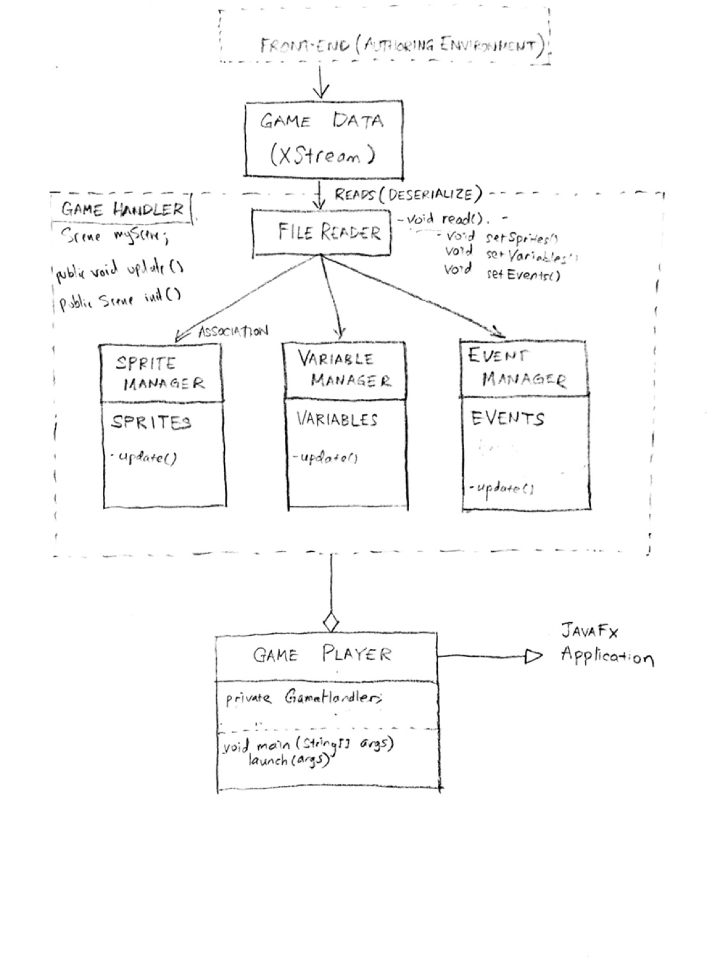
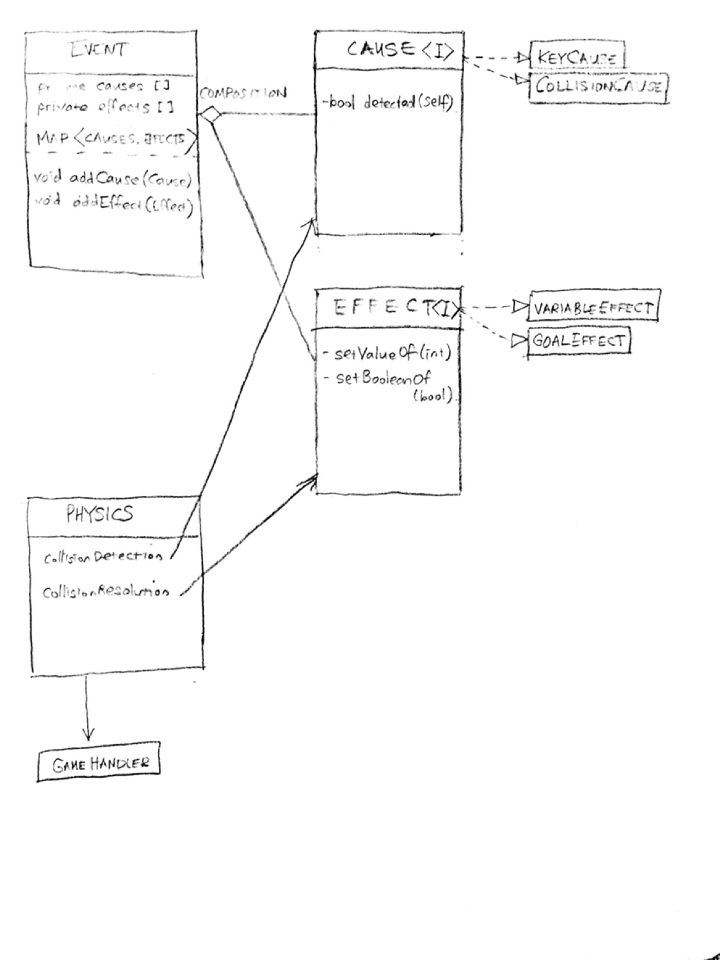

Voogasalad: Design Document: Team DoovalSalad
===================
# Team members
* Anita Desai
* Arjun Desai
* Harry Guo
* Saumya Jain
* Michael Kuryshev
* Hunter Lee
* Nick Lockett
* Krista Opsahl-Ong
* Aditya Srinivasan
* Joshua Xu

# Introduction
- For our project, we will be creating a program that enables users to create and play platformer games (ex: Super Mario Bros., Sonic, Flappy Bird, Donkey Kong). Platformer games often have the main hero (character) moving across the terrain and the map in order to progress. There are a number of key qualities of Scrolling Platformer that make it a unique game genre. First, platforms used in Scrolling Platformer can have different environments and traits. For instance, in some games, certain platforms can be passed through from above but not below. Others can have varying levels of friction, such as ice, which causes the player to have reduced control of his character’s movement. Also, some platform games have differing components in the map such as physical obstacles rather than just enemies that the players have to avoid such as boxes, walls,  lakes or lava (the last two of which will probably end the game). Additionally, some platform games have objects, such as vines in Donkey Kong or ropes in Sonic, that the main hero can and must make use of to reach another platform. 
- Moreover, the direction of movement is unique to each Scrolling Platformer. The game may scroll either sideways--left and right (e.g. Mario and Sonic), upwards (e.g. DoodleJump), or downwards (FallDown) and gravity levels differ depending on the game. Levels can also progress in different ways. In some scenarios the scene changes to a new one when the hero moves to the other side of the screen. In other scenarios, the screen is constantly scrolling. This could also be customized to fit other sub-goal conditions (conditions that check for whether the user gets to move onto the next level).
- Furthermore, collisions add another layer of complexity in Scrolling Platformers. One type of collision could be where a hero jumps on an enemy to attack it. Another could be when a hero shoots an enemy in order to attack.  Additionally, blocks such as a spike blocks or lava can damage the hero or make it bounce off.
Our design will need to be able to handle these multiple layers of complexity, namely, objects, blocks, events, physics, etc.. An extremely important aspect of platformers is handling the collisions between the hero and platforms, which will be done through the physics engine. Our program will need to be handle multiple scrolling directions, and handling what events will cause a level end or the entire game to end.

# Overview
- The primary goal of our project’s design is to write a Scrolling Platformer game framework that can support the seamless interaction of the game authoring environment and game playing environment. A key characteristic we will strive for is the flexibility that users will have when they are creating the game so that they will be able to manage the creation of data from the authoring environment and reading-in of data in the player environment. For this key functionality, we have decided that game data would be a channel through which the game authoring environment and player will interact.

- This abstraction allows users to create hierarchies of levels and sprites, enabling them to come up with a unique game of their own. The following is the bigger picture of our rough design of the program.

#UML

### Modules
Modules
* Authoring 	
	* Resources: all resources (author-uploaded and default) available for author to use in game
		* Explorer.java: Explorer Window- displays the resources to the user to select from
		* ResourceDragger.java: allow user to drag resource from Explorer window onto Authoring Window
		* ResourceProperties.properties: maps resource name (as written in XML) to path of the resource on the local device
		* Resources.xml: uses XML tagging to mirror folder-tree structure where the leaves are
		* Implementation
		  	* Double click lets you preview: opens image, plays music, etc

 	* Authoring Game: how the author creates the game on the Graphics Window
		* ResourceDragger.java: allow user to drag resource from Explorer window onto Authoring Window
		* Properties.java: Properties Window- displays variables of selected object
		* AuthoringWindow.java: Scrollable pane where the user can drag and drop items onto and program interactions
		* Objects: creating and editing objects and their variables

 	* Cause-Effect Relationship: regulates the events (causes and effects having to do with variables and collisions)
		* Event.java: contains a bundle of causes and a bundle of effects

 	* Saving/Loading Game: process of saving and loading the game data the author created
		* XMLWriter.java: used to write data onto XML file for Game Engine to run
		* XMLReader.java: used to read data from XML to load authoring workspace or launch game
		* Game Data XMLs: tracks all the additions and deletions the author has made to the game
			* Used by Game Engine to launch game
			* Used to save progress of user

 	* Objects: all objects (static, character, AI)
		* Characteristics (Interfaces)
			* Imageable.java: can be represented by an image
			* Moveable.java: can move
			* Sizeable.java: can be sized (related to Imageable)
			* Collidable.java: interacts with other objects (onCollision)
	* StaticObject.java: data and management related to objects that dont move
	* CharacterObject.java: data and management related to user-controlled objects
	* AIObject.java: data and management related to computer-generated/controlled objects
			
 	* Miscellaneous:
		* Vector.java: represents vectors in x,y,z-coordinate axis
* Player
  	* Front-end
    		* Display.java: Display all of the positions and visible parameter states for the sprites of the current frame
  	* Back-end
* Data
    	* SpriteManager.java: update() sprite data 
    	* VariableManager.java: update() variables values
    	* EventManager.java: update() cause booleans for effects
    		* Cause.java: detect whether booleans of conditions are true
    		* Effect.java: if causes all true, cause x event to occur
* Physics
    	* PhysicsEntity.java: 
    	* CollisionDetector.java: detect overlap of Collidable sprites
    	* CollisionSolver.java: Resolve which two Collidable objects collided
    	* PhysicsEngine.java: perform calculations for translations of sprites

* Goal
    	* Transition.java: Move to next level if conditions met
* Resources
    	* FileReader.java: Deserialize XML document to obtain data values for use
	

	
	
	
	
	
# User Interface
Authoring: 

UI Design

* Explorer: resources for user to use (images, sounds, fonts, texture, colors  etc) organized with folders 
* Properties: where selected objects variables appear and can be edited
* Graphics Window: GUI for game authoring environment
 	* Characteristics
		* ScrollPane
		* StackPane inside of ScrollPane
	* Uses
		* Drag and drop images
		* Select objects to edit
	* Toolbar
		* Run
		* Save
		* Add Object
	* Menubar
		* File
			* New Game
			* Save
			* Load
			* Run
		* Edit
			* New
				* Game Object
				* Event
				* Global Variable
			* Copy
			* Paste
		* Help
		
# Design Details
* The modules can be seen above. With each module's purpose and outcome listed, the only remaining parts to discuss are why they are present the way they are and discuss extensions. While the modules are well divided between authoring, player, data, engine, and physics, one item to note is the need to read XML data in both resources for the authoring and player environments. This overlap results from readnig load files when reopening a previously worked on level in authoring, while the player is actively reading the data frame by frame to check for updates, events, and such. Each module centers around the data in the end with the authoring environment seperately reading and writing from it for creating levels while the player reads and may load to update and potentially load mid-level states. From the data core, each module directly branches with no other dependencies. By having this closed, independent module system, we are able to readily add any features and have them operate solely from the data. Whether the module is for resizing windows or implementing physical reactions to detected collisions, we are able to individually create and operate code for testing and use which allows us maximum potential functionality and flexibility. Moving forward, we will apply the above modules seperately and unify them to produce a cohesive, closed, and flexible final project: the best representation of the purpose of this course.

# Example games
* Super Mario Bros
  * Super Mario Bros. has multiple platform types, enemy types, the screen that moves with the main hero (Mario), and a goal of reaching a certain point (castle) or defeating a boss (bowser). Our level creator will work for all of these features. First, we will let users in the authoring environment to set create the goal of reaching a flagpole (castle) for the normal levels or defeat a boss (bowser) in a boss level. This would be done using cause-effect structure that we define for all events. Enemy behavior in Mario is simple in that enemies go forward and backward and change directions when they hit an object (wall). This type of behavior can be set in the authoring environment. The screen scrolling with the hero feature will also be one of our scrolling options that we pre-set for the user. Hero actions include horizontal walking (left and right), jumping, and possible state change (eat a mushroom, eat a flower). The physics engine will be in charge of handling all of the collision detection and collision resolution.
  
* Flappy Bird
  * Bird constantly falls but can increase upwards acceleration per click input. Goal is to pass through as many randomly generated gaps as possible without touching pipes. Any collision spells certain death.

* Sonic 
  Like Mario, jump on bad fellows to get from point A to B but with emphasis on speed to be able to run across loops, make homing attacks and have freedom to scroll very fast and left or right. 
  
  
# Design Considerations

* Key characteristics considered
  * Abstraction
    *
  * Extendability
    *
  * Concurrency
    * (by concurrency, I mean authoring environment and player could be run concurrently?)
  * And more
* Alternative designs proposed
  * (not necessary, but we could talk about Unity and how we could have used a scripting language to make it as flexible as possible for the user)
